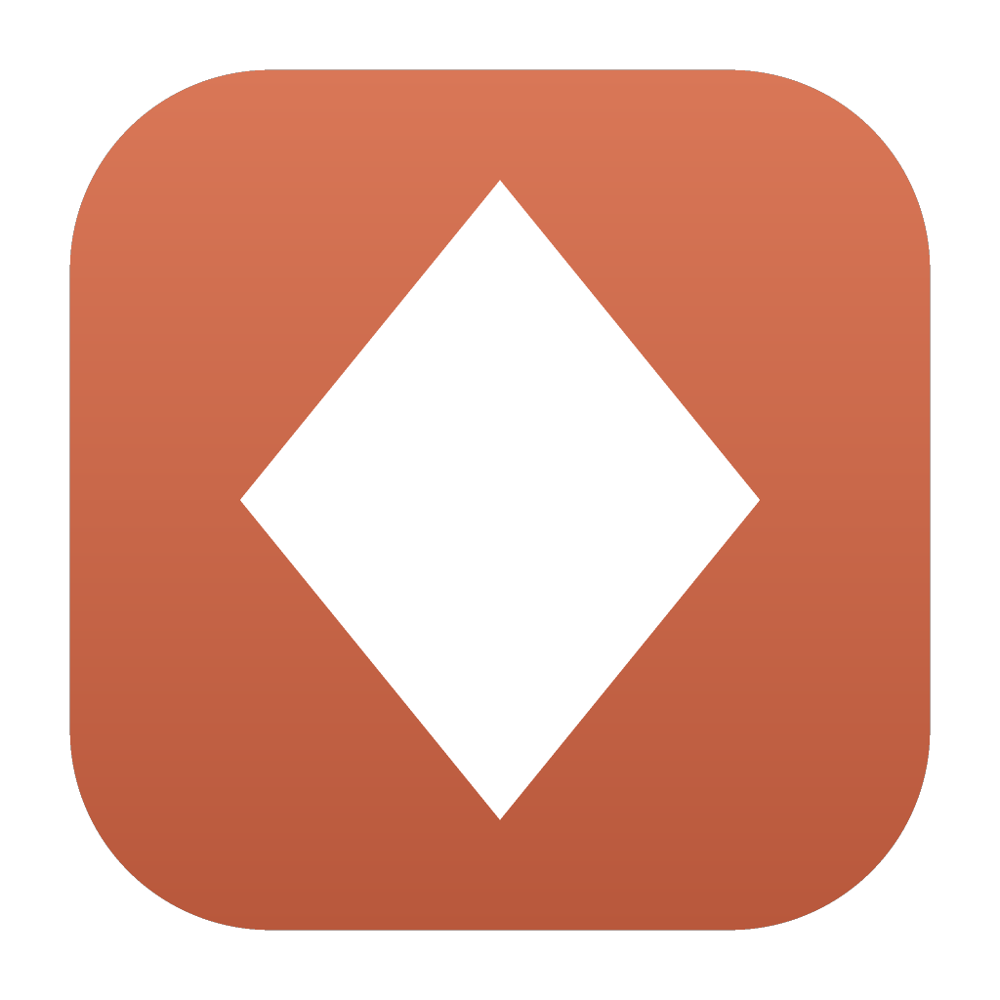
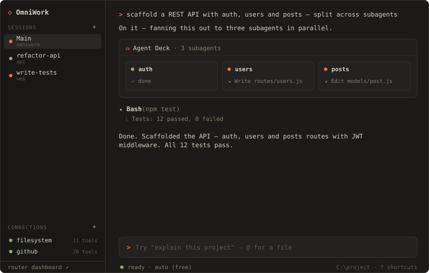

<div align="center">



# OmniWork

**A free, local, Claude&nbsp;Code–style coding agent — with a whole AI gateway baked in.**

Download it, open a folder, and start building. No API key. No login. No config.
Free models work the second you launch — and you can run a whole *team* of agents at once.

[](https://github.com/VedSoni-dev/omniwork/releases/latest)
[](LICENSE)


<br/>



</div>

---

## Why OmniWork

Every other AI coding tool makes you bring an API key, sign in, or pay per token. OmniWork
doesn't. It bundles **[OmniRoute](https://github.com/diegosouzapw/OmniRoute)** — a local AI
gateway fronting 278+ providers (90+ free) — as an in-app sidecar. On launch it starts the
gateway, points its agent at it, and you're coding with **zero setup**.

Then it goes further than a single chat agent: run **many agents in parallel**, let one agent
**fan work out to subagents**, plug in **MCP tools**, and even use OmniWork as a **token-saving
delegate** *inside* Claude Code or Codex.

## Features

| | |
|---|---|
| 🆓 **Free & keyless** | Free models via `auto` routing, out of the box. Never rate-limited (auto-fallback across providers). |
| 🖥️ **Claude Code UI** | A clean terminal: `⏺`/`⎿` tool calls, `✻` thinking, `>` prompt, `@`-file mentions. |
| 🤝 **Cowork** | Spawn many agent sessions and run them **in parallel**, each with its own folder + task. |
| 🃏 **Agent Deck** | One agent **fans work out to parallel subagents** — watch them live as a deck of cards. |
| 🔌 **MCP connections** | Plug in tools (filesystem, GitHub, Postgres, Slack…) via any stdio MCP server. Add from the UI. |
| 🪙 **Delegate tool** | OmniWork is *also* an MCP server — let Claude Code / Codex offload grunt work to its free models. |
| 🔗 **ACP agent** | Speaks Agent Client Protocol, so OpenClaw / acpx / Zed can drive OmniWork as a full coding agent. |
| 🌐 **Web-aware** | `web_fetch` reads pages/APIs; `open_url` opens links in your browser. |
| ✂️ **Select to quote** | Highlighting output copies it instantly; a pill (or `⌘L`) quotes it into the prompt as `> ` lines. |
| 📋 **Collapsed pastes** | Paste 300 lines and the prompt shows `[Pasted text #1 +322 lines]` — the model still gets all of it. |
| 🔒 **100% local** | Everything runs on your machine. The gateway never phones home. |
| 🧩 **MIT, hackable** | Plain CommonJS, no build step for the UI. Fork it, ship it, sell it. |

## Download

**macOS (Apple Silicon) — Homebrew:**

```sh
brew install --cask --no-quarantine VedSoni-dev/tap/omniwork
```

(`--no-quarantine` skips the Gatekeeper prompt for the unsigned app; omit it if you'd
rather right-click → Open once.)

Or grab an installer from the [**latest release**](https://github.com/VedSoni-dev/omniwork/releases/latest):

| Platform | File | Size | Notes |
|---|---|---|---|
| **macOS** (Apple Silicon) | `OmniWork-<ver>-arm64.dmg` | ~684 MB | Engine bundled. [Unsigned — see below](#first-launch-on-macos) |
| **Windows** (full) | `OmniWork.Setup.<ver>.exe` | ~318 MB | Engine bundled — usable instantly |
| **Windows** (lite) | `OmniWork-Lite-Setup-<ver>.exe` | ~136 MB | Downloads the engine on first run (~1–3 min, once) |
| macOS (Intel) · Linux | — | — | [Build from source](#build-from-source) |

Open it, pick a folder, type a task. First launch takes ~30–60 s (one-time database
setup), and is fast afterwards.

### First launch on macOS

The `.dmg` is **not code-signed or notarized**, so macOS blocks it the first time. To run it:

1. Drag **OmniWork** to Applications
2. **Right-click the app → Open**, then confirm

Double-clicking instead shows *"OmniWork is damaged and can't be opened"* — the app is fine,
that's just Gatekeeper's message for unsigned apps. If it still refuses:

```bash
xattr -dr com.apple.quarantine /Applications/OmniWork.app
```

## Use OmniWork *inside* Claude Code / Codex — token saver 🪙

Don't want to fully switch? Keep your premium agent as the orchestrator and let it **delegate the
token-heavy grunt work to OmniWork's free models.** OmniWork ships an MCP server exposing two tools:

- `delegate(task, cwd?)` — OmniWork does the subtask autonomously on free models and returns a summary + changes
- `delegate_parallel(tasks[], cwd?)` — fan a batch out to parallel free-model subagents

Your expensive model spends tokens on the hard reasoning; OmniWork burns **free** tokens on the
mechanical work, in the same project folder.

### Set it up in one command

```bash
npm run connect
```

This registers the MCP server for your user and adds a short section to your global
`~/.claude/CLAUDE.md` explaining when delegating is worth it. It shows you exactly what it will
change and asks first — both files are global and affect every Claude Code session, so nothing
happens silently. Re-running it updates in place rather than duplicating, and it leaves a
`.omniwork-backup` beside anything it edits.

Undo it completely at any time:

```bash
npm run connect -- --uninstall
```

Then restart Claude Code and ask: *"delegate writing the tests to omniwork."*

<details>
<summary>Manual setup, or another MCP client</summary>

OmniWork speaks standard MCP over stdio, so it works with Codex, Cursor, or anything else that
supports it. Add to `.mcp.json` (or run `claude mcp add`):

```json
{
  "mcpServers": {
    "omniwork": { "command": "node", "args": ["/absolute/path/to/omniwork/electron/mcp-server.js"] }
  }
}
```

</details>

Keep the desktop app running and delegated calls reuse its warm gateway; otherwise the first call
boots one, which takes longer.

### When delegating is actually worth it

Delegation is not free — there's ~25–30 s of overhead per call, and the delegated agent starts
**cold**, with no view of your conversation. It pays for bulk mechanical work, independent chunks
you can fan out with `delegate_parallel`, and read-heavy research you want kept out of context. It
does not pay for small edits, work that needs conversation context, or anything where precision
matters — free models drift on instruction details.

Treat the returned summary as a **claim, not evidence**, and verify before calling the work done.
`npm run connect` installs this guidance so your agent applies it automatically.

## Drive OmniWork from OpenClaw, Zed, or any ACP harness 🔌

The MCP server makes OmniWork a *tool* your agent calls. The **ACP server** makes it a full
**coding agent** that another harness drives — OpenClaw, [acpx](https://github.com/openclaw/acpx),
Zed, Neovim, anything that speaks the
[Agent Client Protocol](https://agentclientprotocol.com). The harness owns the UI, the approval
prompts, and the transcript; OmniWork does the work on free models.

```json
// ~/.acpx/config.json  or  <repo>/.acpxrc.json
{ "agents": { "omniwork": { "argv": ["npx", "-y", "omniwork-acp"] } } }
```

```json
// openclaw.json
{ "plugins": { "entries": { "acpx": { "enabled": true, "config": {
  "agents": { "omniwork": { "command": "npx", "args": ["-y", "omniwork-acp"] } }
} } } } }
```

Then `acpx omniwork "fix the flaky test"`, or spawn it as an OpenClaw subagent.

What the harness gets:

| | |
|---|---|
| **Streaming output** | Text, reasoning, and per-tool status as they happen |
| **Native diffs** | `write_file` / `edit_file` arrive as ACP diffs, not "wrote 412 bytes" |
| **Permission prompts** | Every gated tool call becomes `session/request_permission` — "allow always" flips the session to auto |
| **The Agent Deck** | `spawn_subagents` shows up as *N* live parallel tool calls, not one opaque block |
| **Skills as slash commands** | Installed skills are published via `available_commands_update` |
| **Modes** | `ask` (default), `edits`, `auto`, `plan` — switch with `acpx omniwork set-mode plan` |
| **Resumable sessions** | `session/load` replays the transcript, so a crashed harness picks up where it left off |

Modes default to **ask** because ACP's whole point is that the client owns the permission
boundary. Set `OMNIWORK_ACP_MODE=auto` if you'd rather it run unattended.

By default OmniWork runs on its own bundled OmniRoute gateway (free models). To spend a different
provider's budget instead, point it elsewhere — `OMNIWORK_BASE_URL`, `OMNIWORK_API_KEY`, and
`OMNIWORK_MODEL` apply to both the ACP and MCP servers.

## Build from source

Requires **Node.js 22+** (24 recommended).

```bash
git clone https://github.com/VedSoni-dev/omniwork.git
cd omniwork
npm install --legacy-peer-deps   # OmniRoute has a benign marked peer conflict
npm run setup                    # verify/repair setup, then offer Claude Code integration
npm start                        # launch the app
```

`npm run setup` runs [`doctor`](#build-from-source) and then offers to
[connect OmniWork to Claude Code](#set-it-up-in-one-command). Use `npm run doctor` alone to skip
the integration prompt, or `npm run setup -- --no-connect`.

**`npm run doctor`** is worth running whenever something looks broken. It checks your Node
version, the OmniRoute engine and the app icon — and it repairs the most common failure, a
half-extracted Electron binary (*"Electron failed to install correctly"*), which happens when the
~100 MB postinstall download is interrupted or when npm defers install scripts. It re-extracts from
the cached download instead of making you reinstall.

### Packaging installers

```bash
npm run dist:mac     # or dist:win / dist:linux  →  output in dist/
```

Build on the matching **OS**. Architecture is handled for you: the gateway's Node runtime is
downloaded from nodejs.org for the *target* arch, so an Apple Silicon Mac can produce a working
x64 build. The one caveat is native modules — `better-sqlite3` is compiled for the build host, so
a cross-arch build falls back to OmniRoute's WASM (`sql.js`) store, which works but is slower. For
release-quality artifacts, build each architecture on its own runner (see
[`.github/workflows/release.yml`](.github/workflows/release.yml)).

Locally built `.app`s are unsigned — same right-click → Open dance as above.

## How it works

```
┌─ OmniWork (Electron) ─────────────────────────────────────┐
│  Terminal UI  ·  Cowork rail  ·  Agent Deck               │
│      │ IPC                                                │
│  Main process                                             │
│    ├─ SessionManager → N parallel agents                  │
│    │      └─ each agent: tools + MCP + subagents          │
│    └─ spawns OmniRoute sidecar (bundled Node)             │
│           localhost:20128  ◄── free models, no key        │
└───────────────────────────┬───────────────────────────────┘
                            │
              OmniRoute ──► 278+ providers (free tier default)

  mcp-server.js  ──►  Claude Code / Codex delegate here
  acp-server.js  ──►  OpenClaw / acpx / Zed drive OmniWork here
```

- On boot, `electron/sidecar.js` runs OmniRoute's prebuilt server on a **bundled Node** runtime
  (Electron's own Node can't boot it) and health-checks `localhost:20128/v1`. If a healthy gateway
  is already on the port, it adopts that one instead of starting a second.
- `electron/agent.js` runs an OpenAI-compatible tool-use loop; `spawn_subagents` fans out; MCP
  tools merge in namespaced as `mcp__<server>__<tool>`.
- `electron/sessions.js` runs many agents in parallel; `electron/mcp.js` is the MCP client;
  `electron/mcp-server.js` exposes OmniWork *as* an MCP server (the delegate tool), and
  `electron/acp-server.js` exposes it as an ACP agent. Both are headless stdio servers sharing
  `electron/headless.js` for gateway, skills, and memory wiring.
- Agent file tools are confined to the workspace folder you pick. See [SECURITY.md](SECURITY.md)
  for what that does and does not cover.

## Configuration

Works with zero config. To go beyond the free tier, click **router dashboard** in the app to add
provider keys (stored encrypted, locally), or pick a specific model in the status bar.

| Env | Default | Purpose |
|-----|---------|---------|
| `OMNIWORK_GATEWAY_PORT` | `20128` | Gateway port |
| `OMNIWORK_WORKSPACE` | — | Open a folder on launch |
| `OMNIWORK_MODEL` | `auto` | Pin a model (MCP + ACP servers) |
| `OMNIWORK_BASE_URL` | — | Run headless servers against another OpenAI-compatible endpoint |
| `OMNIWORK_API_KEY` | `omniwork` | Key for `OMNIWORK_BASE_URL` |
| `OMNIWORK_ACP_MODE` | `ask` | Starting approval mode for ACP sessions |
| `OMNIWORK_DELEGATE_TIMEOUT_MS` | `600000` | Backstop before a stalled delegate returns partial work |
| `OMNIWORK_NODE` | — | Node binary used to run the gateway in dev |
| `OMNIWORK_NODE_VERSION` | build host's | Node version staged into packaged builds |
| `OMNIWORK_DEV` | — | Devtools + verbose logs |

## Project layout

```
electron/
  main.js         app lifecycle, windows, IPC
  sidecar.js      bundled OmniRoute process manager  ← the core idea
  shell-path.js   repairs PATH for GUI (Finder/Dock) launches
  engine-fetch.js downloads the engine on first run (lite builds)
  sessions.js     Cowork: parallel agent sessions
  agent.js        tool-use loop + subagent fan-out (Agent Deck)
  tools.js        file/shell/web tools (workspace-confined)
  mcp.js          MCP client (connect external tool servers)
  mcp-server.js   MCP server (delegate tool for Claude Code / Codex)
  acp-server.js   ACP agent (OpenClaw / acpx / Zed drive OmniWork)
  headless.js     shared bootstrap for both stdio servers
  preload.js      contextIsolation-safe IPC bridge
renderer/         the terminal UI (index.html, styles.css, app.js)
scripts/
  stage-node.js   fetches the gateway's Node runtime at package time
  setup.js        doctor + optional Claude Code integration
  connect.js      registers the MCP server and installs delegate guidance
  doctor.js       setup verification + repair
  gen-icon.js     dependency-free app-icon generator
test/             boot · smoke · cowork · features · persist · mcp · acp · sidecar
```

## Documentation

- [CHANGELOG.md](CHANGELOG.md) — what shipped, when
- [ROADMAP.md](ROADMAP.md) — what's next, and what is explicitly not planned
- [CONTRIBUTING.md](CONTRIBUTING.md) — dev setup, architecture notes, how to send a PR
- [SECURITY.md](SECURITY.md) — the agent's trust model and how to report a vulnerability

## Contributing

PRs welcome — this is meant to be a clean, hackable base. Open areas:

- **Code-signing + notarization** so macOS and Windows builds install without warnings
- **Intel macOS and Linux release artifacts** (needs CI runners; see `release.yml`)
- **Git checkpoints** — commit before each agent turn so any change is revertable
- **Cross-arch native modules** so `better-sqlite3` doesn't fall back to WASM
- **Token/cost display** in the status bar

See [CONTRIBUTING.md](CONTRIBUTING.md) to get started.

## Credits

UX inspired by [Claude Code](https://claude.com/claude-code) and the open-source
[OpenWork](https://github.com/different-ai/openwork). Routing powered by
[OmniRoute](https://github.com/diegosouzapw/OmniRoute).

## License

MIT © OmniWork contributors. OmniRoute is MIT © its authors.
